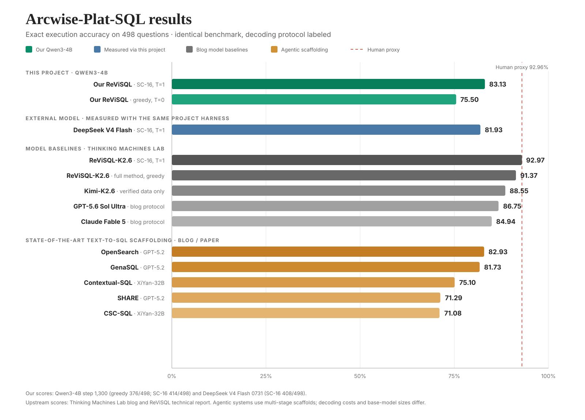

# ReViSQL-BIRD：Qwen3-4B Text-to-SQL RLVR

从原始 `Qwen3-4B-Instruct-2507` 出发，在 BIRD-Platinum 上进行 RLVR 训练后，最佳
checkpoint 在 Arcwise-Plat-SQL 上取得 **75.50% greedy** 和
**83.13% SC-16**；在全校正的 Arcwise-Plat 上取得 **81.12% greedy**。



| 数据集 | Exact execution | 说明 |
| --- | ---: | --- |
| **Arcwise-Plat** | **404/498 = 81.12%** | SQL、问题、evidence 和 schema 全校正 |
| **Arcwise-Plat-SQL** | **376/498 = 75.50%** | 只校正 SQL；与参考文章主榜口径一致 |
| BIRD Full Dev | 961/1,534 = 62.65% | 原始、含噪标注 |
| BIRD Mini-Dev | 298/500 = 59.60% | 原始、含噪标注 |

> 图中的上游结果来自 Thinking Machines Lab 的
[ReViSQL 文章](https://thinkingmachines.ai/news/putting-task-expertise-into-rl/)及其
[技术报告](https://arxiv.org/abs/2603.20004)：除 ReViSQL-K2.6、GPT-5.6 Sol Ultra
和 Claude Fable 5 外，也包含五个使用 GPT-5.2 或 XiYan-32B 的 agentic
text-to-SQL scaffolding。DeepSeek V4 Flash 及本项目 SC-16 均由本仓库按相同
`temperature=1`、16 候选执行结果多数票协议实测；不同模型规模和推理协议已在图中标注。

> 完整实验记录见 [docs/RESULTS.md](docs/RESULTS.md)。

验证集最优的 step 1,300 LoRA adapter 已发布到
[Hugging Face：ximosss/ReViSQL-Qwen3-4B](https://huggingface.co/ximosss/ReViSQL-Qwen3-4B)。

## Motivation

对于客服流程自动化, 通过sql直接查询数据库的方式显然比预定设计好的有限按钮和问答模版更好. 相较于传统规则匹配方式, 一般的客服Agent需要接入作用有限的业务API, 而SQL Agent的好处是提供了有关数据库访问原本的的灵活性, 远远放宽了用户的查询和操作范围. 由于直接和内部的数据库对接, 存在数据安全和隐私上的风险, 使用最好的前沿模型是不可能的. 尽管通过增加中间层能够缓解这一问题, 不过更好的方法是使用local model. 问题在于, 在面对较为复杂的真实业务时, sql agent with local slm 能否达到前沿llm的标准.

直觉上, sql(dql)的动作空间不算大, 每个关键词的使用范围都是极其有限的, 这也就意味着正确的组合是很容易被学习到的. 剩下的就仅仅是语义理解的问题, 即把握到实体具有的属性以及不同实体之间的关系. 而这一点恰好是大语言模型所擅长的. 另外一点是, sql在验证上也是快速且廉价的, 仅依赖于本地的数据库文件, 不仅有一个明确的结果, 也有可拆解和分析的过程, 因而直接通过RLVR提升理应是可行的(跳过SFT).

Yuxuan Zhu等人和Thinking Machines的合作结果给出了一个非常优秀的案例. 在Kimi-K2.6上RLVR得到的ReViSQL-K2.6第一次达到了人类级别精度的text-to-sql. 但Kimi-K2.6并不是一个合适的local model. 它并不合适作为subagent或者tool被其他更加强大的model调用, 更不能仅仅为了text-to-sql一个目标去引入这个巨物. 这里的信念是, 写sql的能力是所有语言模型都有的基础能力在一个窄的任务分布上的重叠. 也就是说, slm理应做得到.

## Method

本工作基本复现了 Yuxuan Zhu 等人提出的 ReViSQL-BIRD 方法(感谢他们). 我受到 VibeThinker-3B 的启发, 选择从原始 Qwen3-4B-Instruct-2507 直接进行 RLVR 训练. 为了适配 Qwen3-4B和本地的Prime-RL 训练环境, 我主要在方法上做了以下修改.

1. **调整优化参数**

   将学习率从 `5×10⁻⁵` 降低到 `1×10⁻⁵`, 以降低小模型和小规模 LoRA 训练中的更新幅度. LoRA rank 保持为 32, 并设置 alpha 为 64, 覆盖 attention 和 MLP 的主要线性层.
2. **缩小实际训练 batch**

   原始 Tinker recipe 中, batch size 64 表示每步包含 64 个题目组, 每题生成 16 个 rollout, 即最多约 1,024 条 trajectory. Prime-RL 中的 batch size 64 表示每步总共训练 64 个 rollout, 因此在 group size 16 下, 每步只包含 4 个题目组.

   这使训练从"大 batch, 较少更新"变成了"小 batch, 更多更新"的形式. 相应地, 我通过更长的训练过程补偿单步题目覆盖率的下降.
3. **降低 rollout 采样温度**

   在多次预实验中, 我观察到了非常严重的格式错漏问题. 即使加大格式惩罚力度也没有明显改善, 因此决定降低采样温度, 将训练采样温度从原方法默认的 `1.0` 降至 `0.8`.
4. **简化上下文中的示例对话**

   原方法默认在 prompt 中加入一条完整的数据库探索 one-shot 对话. 为了减少固定上下文占用, 我移除了该 one-shot prefix, 改为通过 system prompt 直接规定工具调用, 多轮探索和最终答案格式.
5. **压缩和约束数据库 observation**

   SQL 工具最多返回 50 行, 每个 cell 最多保留 200 个字符, 并额外设置 12,000 字符的 observation 总上限, 防止宽表或长文本查询迅速耗尽 Qwen3-4B 的上下文窗口.
6. **在 schema 中加入少量真实数**

   我在之前实验的错题分布中观察到, 模型有时无法纠正一些细小错误. 因此, 我决定为每张表加入最多 3 行真实样例, 帮助小模型识别日期, 枚举值, 标识符, 大小写和 NULL 等实际数据格式.
7. **调整格式奖励强度**

   格式错误奖励在训练早期对模型的影响过大, 导致执行准确率奖励被压制. 因此, 我将格式错误的奖励设置为 `-0.05`, 以避免早期大量格式失败主导学习信号.

在此之前, 我探索过 SFT-RL 两阶段微调, 尝试通过 teacher CoT 扩展模型的 SQL 能力. 但由于没有控制好 SFT 数据集, 模型记住了其中的大部分题目, 导致后续 RL 阶段难以获得有效的组内优势信号.

此外, 在 RL 阶段观察了 base model 的评测通过率和错误题目分布之后, 我还是无法确定是Bird训练集的问题导致错上加错, 还是模型本身的能力问题. 直到看到 Thinking Machines 的 blog, 才有了干净的数据集和有效的训练 recipe. 在此特别感谢他们的工作.


## 项目介绍

本项目复现 ReViSQL 的核心思路，并将其适配到 Qwen3-4B：使用经过专家校正的
BIRD-Platinum 数据、CISPO、SQL 执行奖励、VeriEQL 语义校验和 evidence process
reward 训练 Text-to-SQL 模型。模型最多进行五轮只读数据库交互，并以
`<solution>SQL</solution>` 提交答案。

主配置：
[`configs/prime-rl/rl-revisql-bird-qwen3-4b-v1.toml`](configs/prime-rl/rl-revisql-bird-qwen3-4b-v1.toml)。
最终权重：
[`ximosss/ReViSQL-Qwen3-4B`](https://huggingface.co/ximosss/ReViSQL-Qwen3-4B)（LoRA adapter）。

| 配置 | 值 |
| --- | --- |
| Base model | Qwen3-4B-Instruct-2507 |
| Objective | CISPO |
| Batch / group size | 64 / 16 |
| LoRA | rank 32, alpha 64 |
| Learning rate | `1e-5` |
| Context / 每轮输出 | 32,768 / 3,072 tokens |
| 训练 / 推理 GPU | 1 / 1 |

## 配置与启动

需要 Linux、Python 3.12、`uv`、`prime`、`tmux`、NVIDIA GPU，以及本地
Qwen3-4B-Instruct-2507 和 BIRD SQLite 数据库。

```bash
uv sync --frozen

git clone https://github.com/PrimeIntellect-ai/prime-rl.git prime-rl
git -C prime-rl checkout ab5de8fff44b2c4a5c85e24b6e6e3f7d57eee7b1
git -C prime-rl submodule update --init --recursive
(cd prime-rl && uv sync --all-extras --frozen)

git clone --depth 1 --branch v1.0 \
  https://github.com/VeriEQL/VeriEQL.git third_party/VeriEQL

prime env install bird-text2sql --path environments --plain
```

默认模型路径是 `/data/qwen3-4b-instruct-2507`。修改本地模型和数据库路径时，检查：

```bash
rg -n '/data/|/home/ubuntu/bird-text2sql-rl' configs/prime-rl scripts
```

下载最终 adapter：

```bash
uvx --from huggingface-hub hf download ximosss/ReViSQL-Qwen3-4B \
  --local-dir models/ReViSQL-Qwen3-4B
```

启动结果面板：

```bash
./scripts/launch_prime_rl_dashboard.sh start
./scripts/launch_prime_rl_dashboard.sh check
```

默认地址：<http://127.0.0.1:7788>。训练和评测均在 tmux 中运行，结果统一写入
`outputs/prime-rl/`。

## 数据集

| Split | 数量 | 用途 |
| --- | ---: | --- |
| BIRD-Platinum train | 2,050 | RLVR 训练 |
| BIRD-Platinum validation | 396 | checkpoint 选择 |
| Arcwise-Plat / Arcwise-Plat-SQL | 498 / 498 | 最终主评测 |
| BIRD Mini-Dev / Full Dev | 500 / 1,534 | 含噪鲁棒性评测 |

从 [ReViSQL](https://github.com/uiuc-kang-lab/ReViSQL) 获取 verified train/validation
annotation，从 [BIRD](https://bird-bench.github.io/) 获取 train/dev SQLite databases。
准备可执行 RLVR 数据：

```bash
uv run scripts/prepare_rlvr_data.py \
  --verified-train /path/to/ReViSQL/data/bird-verified-train.json \
  --verified-validation /path/to/ReViSQL/data/bird-verified-val.json \
  --database-root /path/to/BIRD/train_databases \
  --output-dir data/processed/rlvr-v2
```

最终评测 annotation 已包含在 `data/eval/`；来源与许可证见
[data/eval/README.md](data/eval/README.md)。

## 训练

首次运行或配置、代码、数据、模型发生变化时执行检查：

```bash
./scripts/launch_revisql_bird.sh check
```

启动 40-step pilot：

```bash
./scripts/launch_revisql_bird.sh pilot <run-name>
tmux attach -t <run-name>
```

从已有 run 继续到指定总 step：

```bash
./scripts/launch_revisql_bird.sh resume <run-name> <target-steps>
```


## 评测

默认评测 step 1,300 adapter，并依次运行四套冻结数据：

```bash
./scripts/launch_revisql_final_eval.sh
```

只运行主评测：

```bash
./scripts/launch_revisql_final_eval.sh arcwise-plat-sql arcwise-plat
```

评测其他 adapter：

```bash
BIRD_ADAPTER=/path/to/adapter \
BIRD_CANDIDATE_MODEL_ID=my-model \
BIRD_RUN_PREFIX=my-model \
./scripts/launch_revisql_final_eval.sh arcwise-plat-sql arcwise-plat
```

评测使用 greedy 单样本（`temperature=0`）和 exact execution accuracy。详细评测
合同见 [docs/EVALUATION.md](docs/EVALUATION.md)。

## 引用

本项目直接使用或复现了以下工作：

1. Yuxuan Zhu, Tengjun Jin, Yoojin Choi, and Daniel Kang. 2026. [Human-Level Text-to-SQL via Reinforcement Learning on Verified Data, Without Pipeline Engineering](https://arxiv.org/abs/2603.20004). arXiv:2603.20004.（ReViSQL-BIRD 与 BIRD-Platinum）

2. Yuxuan Zhu, Tengjun Jin, Yoojin Choi, and Daniel Kang. 2026. [Putting Task Expertise into RL Achieves State-of-the-Art Performance on Text-to-SQL](https://thinkingmachines.ai/news/putting-task-expertise-into-rl/). Thinking Machines Lab.

3. Tengjun Jin, Yoojin Choi, Yuxuan Zhu, and Daniel Kang. 2026. [Pervasive Annotation Errors Break Text-to-SQL Benchmarks and Leaderboards](https://arxiv.org/abs/2601.08778). *Proceedings of the VLDB Endowment*.（Arcwise-Plat 与 Arcwise-Plat-SQL）

4. Jinyang Li et al. 2023. [Can LLM Already Serve as a Database Interface? A BIg Bench for Large-Scale Database Grounded Text-to-SQLs](https://arxiv.org/abs/2305.03111). *NeurIPS 2023*.（BIRD）

5. Yang He, Pinhan Zhao, Xinyu Wang, and Yuepeng Wang. 2024. [VeriEQL: Bounded Equivalence Verification for Complex SQL Queries with Integrity Constraints](https://arxiv.org/abs/2403.03193). *Proceedings of the ACM on Programming Languages*, 8 (OOPSLA1), 1071–1099.

6. Prime Intellect. 2025. [prime-rl](https://github.com/PrimeIntellect-ai/prime-rl). GitHub repository.

7. William Brown. 2025. [Verifiers: Environments for LLM Reinforcement Learning](https://github.com/PrimeIntellect-ai/verifiers). GitHub repository.
